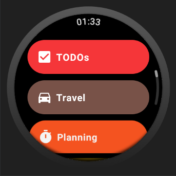

# Simple Time Tracker for Wear OS

A fork of Simple Time Tracker with WearOS support.

<!-- BADGES -->

|                                                                         |                                                                          |
| ----------------------------------------------------------------------- | ------------------------------------------------------------------------ |
|  |  |

## WearOS Status

While **not ready for production**, this project has a solid foundation for Wear
<->
Mobile communication and is now open to contributors for adding functionality
and UI/Design.

Check the GitHub Issues for details about the next steps. Once this fork reaches
stability, we will open a PR back into the upstream application so everyone can
benefit from these improvements!

------
------

*Original README...*

# Simple Time Tracker

Simple app that helps track how much time you spend on all the useless activities in the world.

## Track different activities

[![main_thumb]][main]
 

## Add, change or delete activities

[![change_record_type_thumb]][change_record_type]
[![change_record_type_color_thumb]][change_record_type_color]
[![change_record_type_icon_thumb]][change_record_type_icon]
 

## View previous records

[![records_thumb]][records]
 

## Add, change or delete records

[![change_record_thumb]][change_record]
[![change_record_activity_thumb]][change_record_activity]
 

## Views statistics on different time ranges

[![statistics_thumb]][statistics]
 

## View detailed statistics

[![statistics_detail1_thumb]][statistics_detail1]
[![statistics_detail2_thumb]][statistics_detail2]
 

## Widgets

[![widgets_thumb]][widgets]
[![widget_universal_thumb]][widget_universal]
 

## Notifications

[![notifications_types_thumb]][notifications_types]
[![notifications_inactivity_thumb]][notifications_inactivity]
 

## Dark mode

[![darkmode1_thumb]][darkmode1]
[![darkmode2_thumb]][darkmode2]
[![darkmode3_thumb]][darkmode3]
 

## Technology stack
- Kotlin
- Multi module
- Single Activity
- MVVM (Jetpack ViewModel + LiveData)
- Jetpack Navigation
- Hilt
- Room, migrations
- Coroutines
- Widgets
- Notifications
- Custom Views (Pie Chart, Bar Chart, Color Selection, Calendar)
- Recycler, custom Adapter Delegates, DiffUtils with Payloads
- Drag and Drop, Gesture detection
- Gradle Kotlin DSL
- View Binding
- Database backup and restore, export to csv, automatic backup
- Dark mode
- Unit tests, UI tests
- CI with github actions
- Emojis with EmojiCompat

## Directory structure
    .
    ├── .github                               # CI files.
    ├── app                                   # Mobile app.
    ├── buildSrc                              # Deps and versions.
    ├── core                                  # Shared classes, strings.
    ├── data_local                            # Database.
    ├── domain                                # Business logic.
    ├── navigation                            # Navigation interfaces and screen params.
    ├── features
    │   ├── feature_archive                   # Screen for archived data.
    │   ├── feature_base_adapter              # Shared recycler adapters.
    │   ├── feature_categories                # Screen for categories and tags.
    │   ├── feature_change_activity_filter    # Edit activity filter screen.
    │   ├── feature_change_category           # Edit category screen.
    │   ├── feature_change_record             # Edit record screen.
    │   ├── feature_change_record_tag         # Edit tag screen.
    │   ├── feature_change_record_type        # Edit type screen.
    │   ├── feature_change_running_record     # Edit timer screen.
    │   ├── feature_date_edit                 # Data edit screen.
    │   ├── feature_dialogs                   # Dialogs.
    │   ├── feature_goals                     # Separate screen for goals.
    │   ├── feature_main                      # Main screen with tabs.
    │   ├── feature_notification              # Notifications.
    │   ├── feature_records                   # One of main tabs, records list.
    │   ├── feature_records_all               # Screen showing all records.
    │   ├── feature_records_filter            # Dialog for records filters.
    │   ├── feature_running_records           # One of main tabs, timers.
    │   ├── feature_settings                  # One of main tabs, settings.
    │   ├── feature_statistics                # One of main tabs, statistics.
    │   ├── feature_statistics_detail         # Screen showing detailed statistics.
    │   ├── feature_tag_selection             # Screen for selecting tags.
    │   ├── feature_views                     # Custom views.
    │   └── feature_widget                    # Widgets.

## License
Copyright (C) 2020-2024 Anton Razinkov devrazeeman@gmail.com

This program is free software: you can redistribute it and/or modify
it under the terms of the GNU General Public License as published by
the Free Software Foundation, either version 3 of the License, or
(at your option) any later version.

This program is distributed in the hope that it will be useful,
but WITHOUT ANY WARRANTY; without even the implied warranty of
MERCHANTABILITY or FITNESS FOR A PARTICULAR PURPOSE.  See the
GNU General Public License for more details.

You should have received a copy of the GNU General Public License
along with this program.  If not, see <https://www.gnu.org/licenses/>.

[change_record_thumb]: dev_files/screens/change_record_thumb.png
[change_record]: dev_files/screens/change_record.png
[change_record_activity_thumb]: dev_files/screens/change_record_activity_thumb.png
[change_record_activity]: dev_files/screens/change_record_activity.png

[change_record_type_thumb]: dev_files/screens/change_record_type_thumb.png
[change_record_type]: dev_files/screens/change_record_type.png
[change_record_type_color_thumb]: dev_files/screens/change_record_type_color_thumb.png
[change_record_type_color]: dev_files/screens/change_record_type_color.png
[change_record_type_icon_thumb]: dev_files/screens/change_record_type_icon_thumb.png
[change_record_type_icon]: dev_files/screens/change_record_type_icon.png

[main_thumb]: dev_files/screens/main_thumb.png
[main]: dev_files/screens/main.png

[records_thumb]: dev_files/screens/records_thumb.png
[records]: dev_files/screens/records.png

[statistics_thumb]: dev_files/screens/statistics_thumb.png
[statistics]: dev_files/screens/statistics.png

[statistics_detail1_thumb]: dev_files/screens/statistics_detail1_thumb.png
[statistics_detail1]: dev_files/screens/statistics_detail1.png
[statistics_detail2_thumb]: dev_files/screens/statistics_detail2_thumb.png
[statistics_detail2]: dev_files/screens/statistics_detail2.png

[widgets_thumb]: dev_files/screens/widgets_thumb.png
[widgets]: dev_files/screens/widgets.png

[widget_universal_thumb]: dev_files/screens/widget_universal_thumb.png
[widget_universal]: dev_files/screens/widget_universal.png

[notifications_types_thumb]: dev_files/screens/notifications_types_thumb.png
[notifications_types]: dev_files/screens/notifications_types.png
[notifications_inactivity_thumb]: dev_files/screens/notifications_inactivity_thumb.png
[notifications_inactivity]: dev_files/screens/notifications_inactivity.png

[darkmode1_thumb]: dev_files/screens/darkmode1_thumb.png
[darkmode1]: dev_files/screens/darkmode1.png
[darkmode2_thumb]: dev_files/screens/darkmode2_thumb.png
[darkmode2]: dev_files/screens/darkmode2.png
[darkmode3_thumb]: dev_files/screens/darkmode3_thumb.png
[darkmode3]: dev_files/screens/darkmode3.png
